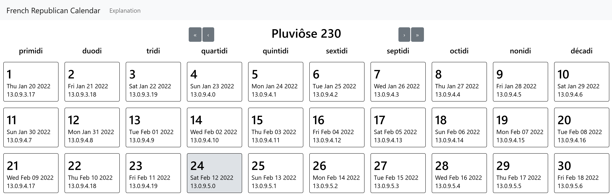

# French Republican Calendar

## What is this?

The [French Republican calendar][0] was a calendar created and implemented
during the French Revolution.

It was also frequently known as the *French Revolutionary Calendar*, but this
was a misnomer: year 1 of the calendar started on 22 September 1792, the day
after the [abolition of the monarchy][1] and the founding of the [French
First Republic][2].

## How does it work?

A year consists of 12 months of 30 days each, divided into three *décades* of
10 days each, followed by 5 complementary days (6 in leap years).

The year starts on the day of the autumnal equinox at the Paris Observatory
(longitude 2°20′14.03″ E). A leap year follow directly from this definition:
a year is a leap year when the next autumnal equinox happens 366 days later
instead of the normal 365. By this definition, the year will **never** drift
with respect to the seasons.

The 12 months are: *Vendémiaire*, *Brumaire*, *Frimaire*, *Nivôse*,
*Pluviôse*, *Ventôse*, *Germinal*, *Floréal*, *Prairial*, *Messidor*,
*Thermidor*, *Fructidor.*

The complementary days are: *la Fête de la Vertu*, *la Fête du Génie*,
*la Fête du Travail*, *la Fête de l'Opinion*, *la Fête des Récompenses,*
and *la Fête de la Révolution* (leap years only).

## What's so special about this version?

Most versions of the calendar floating around doesn't use the original
definition above.

Most versions uses the so-called *Romme* method for leap years, using the
same leap year rules as the Gregorian calendar, i.e. every year divisible
by four, except century years not divisible by 400. This method might make
sense, except years 3, 7, and 11 were leap years under the original rules
and were observed as such in real life, but the *Romme* method instead makes
years 4, 8, 12 leap years instead.

This version uses the original rules. The [JPL's DE440 and DE441
ephemerides][3] were used to calculate the exact timings of the autumnal
equinoxes between the Gregorian years 13201 BCE and 17191 CE (corresponding
to the French Republican years -14991 to 15399). The times were then converted
to UT1+00:09:21, the exact local time at the Paris Observatory. UT1 was chosen
to keep track of the Earth's rotation without having to worry about the issues
posed by leap seconds in UTC. Note that due to the uncertainty over [ΔT][4] —
the difference between UT1 and Terrestrial Time (TT) used in the ephemerides —
it is theoretically possible for there to be inaccuracies when the equinox
occurs very close to midnight.

[0]: https://en.wikipedia.org/wiki/French_Republican_calendar
[1]: https://en.wikipedia.org/wiki/Proclamation_of_the_abolition_of_the_monarchy
[2]: https://en.wikipedia.org/wiki/French_First_Republic
[3]: https://ssd.jpl.nasa.gov/planets/eph*export.html
[4]: https://en.wikipedia.org/wiki/%CE%94T*(timekeeping)
