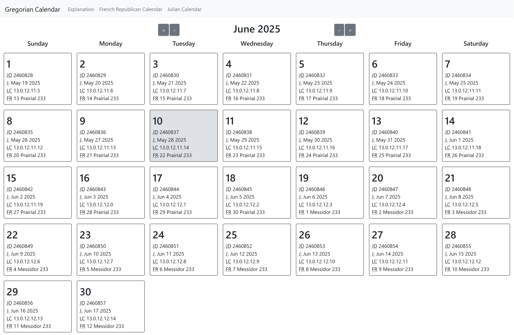

# Gregorian Calendar

## What is this?

This is an implementation of the [Gregorian calendar][0], which is the default
civil calendar in most countries. It is meant to help you cross-reference dates
by providing the conversions various other calendars and time-keeping systems,
such as:

1. the [Julian day number][2] (JDN);
2. the [Julian calendar][1] date;
3. the [Mesoamerican Long Count calendar][3] date; and
4. the [French Republican calendar][4] date.

You can [see it live here][5]! More conversions will be added in the future.

## The Gregorian calendar

The Gregorian calendar itself is based on the Julian calendar, originally
introduced in 46 BC by Julius Caesar (with aid of Sosigenes of Alexandria).
Unfortunately, the Julian calendar had leap days every four years without
question, resulting in the average year having 365.25 days. However, the actual
tropical year is roughly 365.2422 days, resulting in it gaining a day every 129
years. This means that seasons drift, starting earlier and earlier in the year.

In 1582, Pope Gregory XIII decided to fix this drift by reducing the number
of leap days, motivated by a desire to keep the March equinox on March 21st,
since that value was hardcoded in the calculation for the date of Easter. To
achieve this, he made years divisible by 100 but not by 400 non-leap years,
resulting in 97 leap years every 400 years. To bring the equinox back into
alignment, October 5th to October 14th in 1582 were deleted, creating the
Gregorian calendar we use today.

This website extends the Gregorian calendar indefinitely into the past for
reference reasons.

[0]: https://en.wikipedia.org/wiki/Gregorian_calendar

[1]: https://en.wikipedia.org/wiki/Julian_calendar

[2]: https://en.wikipedia.org/wiki/Julian_day

[3]: https://en.wikipedia.org/wiki/Mesoamerican_Long_Count_calendar

[4]: https://en.wikipedia.org/wiki/French_Republican_calendar

[5]: https://gcal.qt.ax/
