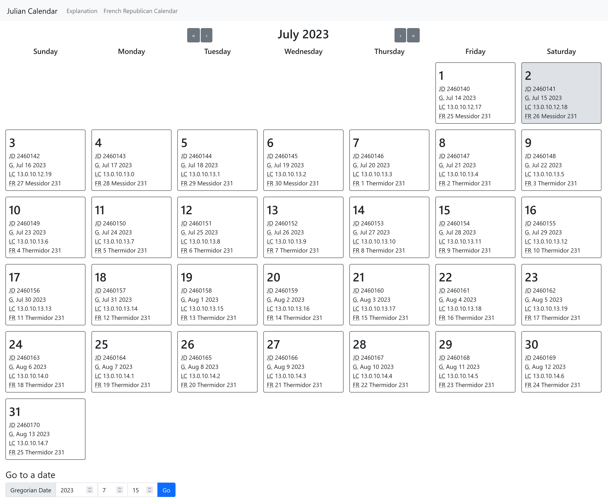

# Julian Calendar

## What is this?

The [Julian calendar][0] is a calendar introduced by Julius Caesar in 46 BC. A
reformed version, the [Gregorian calendar][1], forms the basis of civil calendar
in most countries.

Julius Caesar (with aid of Sosigenes of Alexandria) introduced this calendar to
replace the earlier Roman calendar, which required manual addition of leap
months to keep it in synchrony with the seasons. Unfortunately, it had leap
days every four years without question, resulting in the average year having
365.25 days. However, the actual tropical year is roughly 365.2422 days,
resulting in the Julian calendar gaining a day every 129 years. This means
that seasons drift, starting earlier and earlier in the year.

In 1582, Pope Gregory XIII decided to fix this drift by reducing the number
of leap days, motivated by a desire to keep the March equinox on March 21st,
since that value was hardcoded in the calculation for the date of Easter. To
achieve this, he made years divisible by 100 but not by 400 non-leap years,
resulting in 97 leap years every 400 years, resulting in the Gregorian calendar.
To bring the equinox back in alignment, October 5th to October 14th in 1582
were deleted. The result is the Gregorian calendar.

This website extends the Julian calendar indefinitely into the future for
reference reasons. Note that in the 20th and 21st centuries, the Julian
calendar is 13 days behind the Gregorian calendar.

[0]: https://en.wikipedia.org/wiki/Julian_calendar
[1]: https://en.wikipedia.org/wiki/Gregorian_calendar
